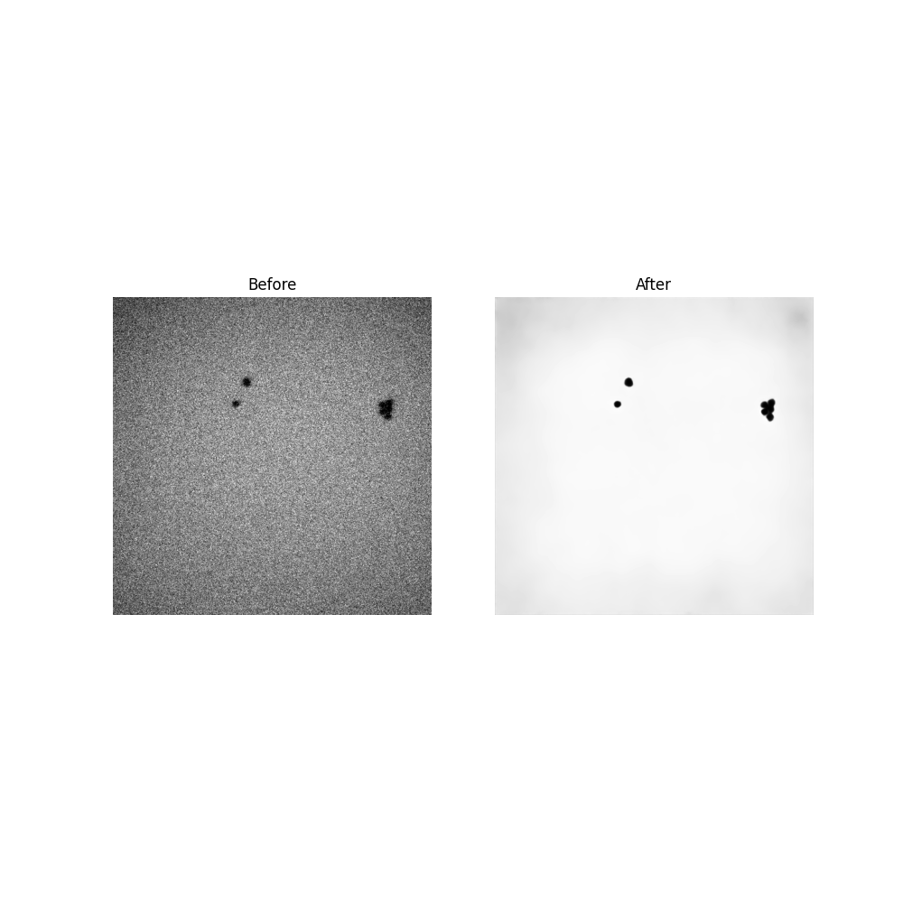

# Machine-learning-refinement-acquired-by-LC-TEM

### Refining images
Check ipynb/main.ipynb.

### Training 
Please check ipynb/main.ipynb.
Training dataset is available [Zenodo](https://doi.org/10.5281/zenodo.10042733).
The text file named list_dataset.txt contains the information on the correspondence of the images acquired in vacuum and in a solution: filename (acquired in vacuum), x1, y1, x2, y2, filename (aquired in a solution), x1, y1.

### Before and After

